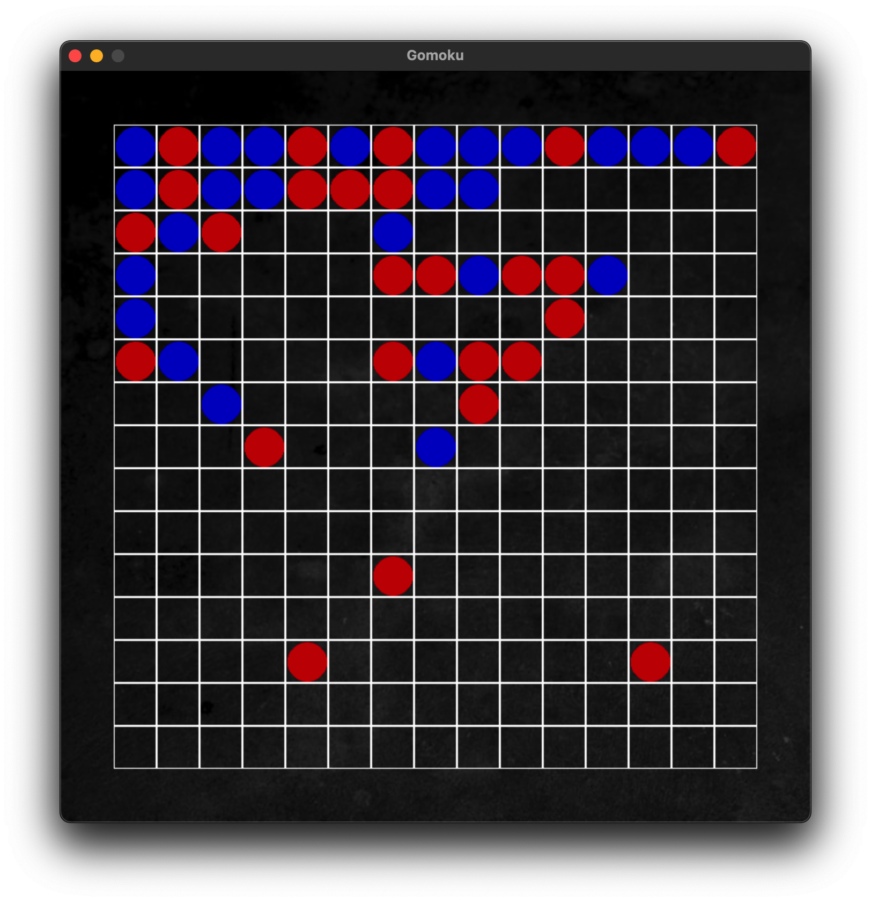

# Gomoku Game

A Python implementation of the classic Gomoku (Five in a Row) game with both CLI and GUI interfaces, featuring AI opponents.



## Features

- **Multiple Interfaces**: Play the game through either a Command Line Interface (CLI) or a Graphical User Interface (GUI) built with Pygame
- **AI Opponents**: Challenge yourself against different AI opponents:
  - Basic computer opponent
  - Advanced AI opponent (in development)
- **Layered Architecture**: Clean, maintainable code structure following software engineering best practices

## Project Structure

```
src/
├── domain/      # Core game logic and domain models
├── services/    # Business logic and game services
├── ui/          # User interface implementations (CLI and GUI)
├── static/      # Static assets (images, sounds, etc.)
└── tests/       # Unit and integration tests
```

## Requirements

- Python 3.x
- Pygame (for GUI version)

## Installation

1. Clone the repository:
```bash
git clone https://github.com/yourusername/gomoku.git
cd gomoku
```

2. Create a virtual environment (recommended):
```bash
python -m venv venv
source venv/bin/activate  # On Windows: venv\Scripts\activate
```

3. Install dependencies:
```bash
pip install -r requirements.txt
```

## Usage

### GUI Version
```bash
python src/main.py --gui
```

### CLI Version
```bash
python src/main.py --cli
```

## Game Rules

Gomoku is a strategy board game where two players take turns placing stones on a 15x15 grid. The objective is to be the first to form an unbroken line of five stones horizontally, vertically, or diagonally.

## Contributing

Contributions are welcome! Please feel free to submit a Pull Request.

## License

This project is licensed under the MIT License - see the [LICENSE](LICENSE) file for details.